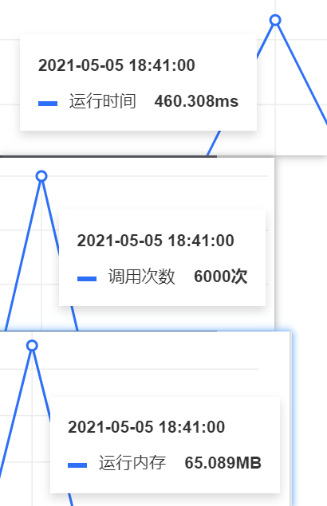
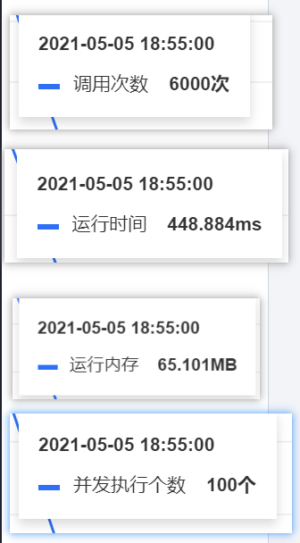
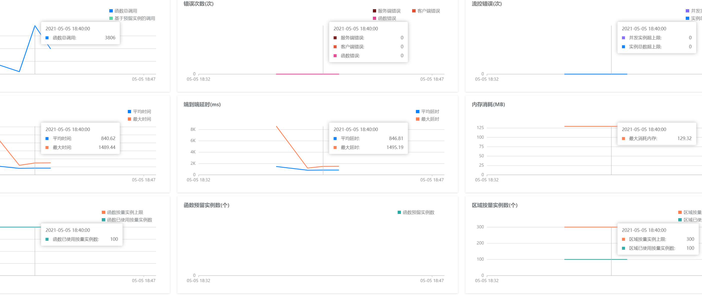
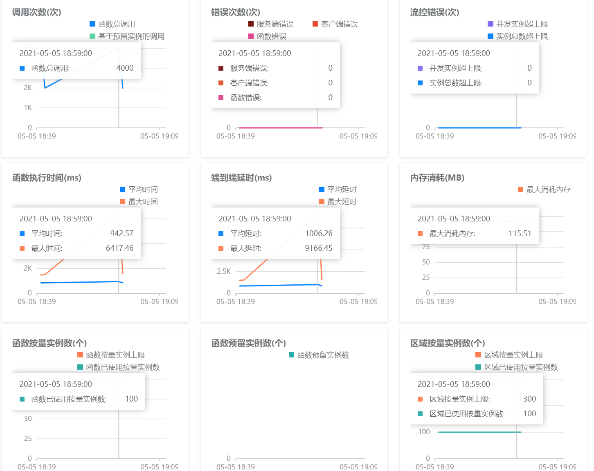
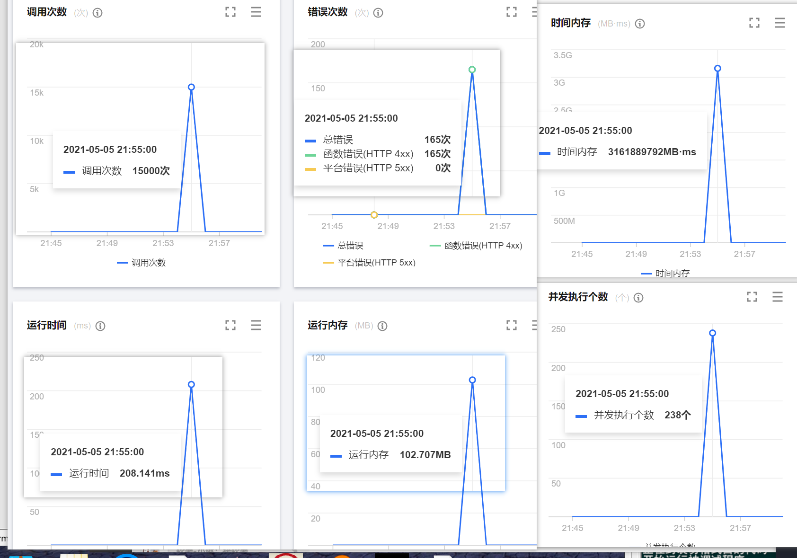
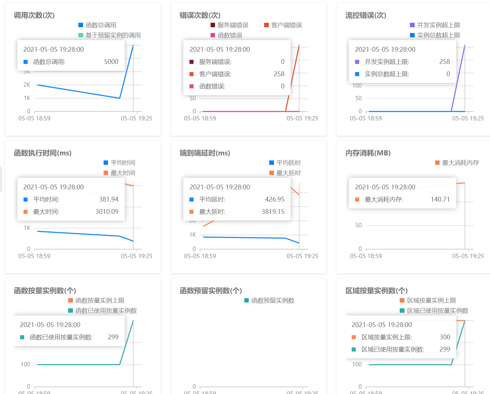
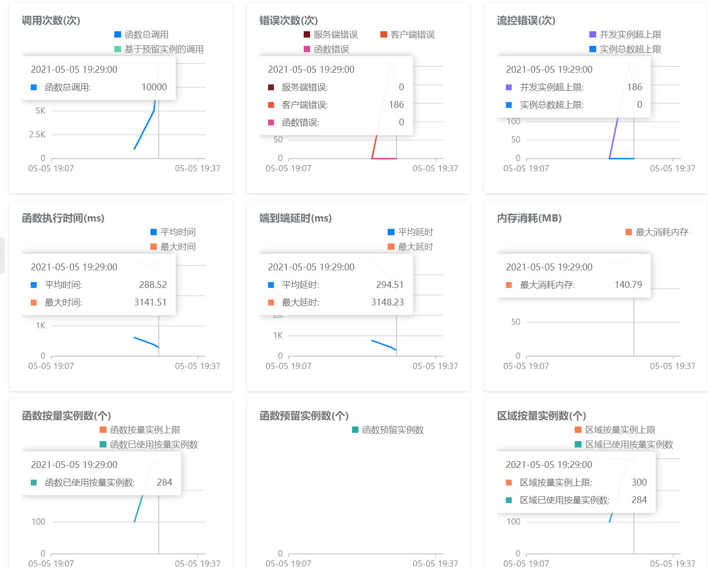

# 前言
将深度学习模型部署到阿里云函数计算和腾讯云云函数中

我整理了相关的性能数据 仅供参考 

部署了百度飞浆开源的ppocr模型

https://github.com/PaddlePaddle/PaddleOCR


# 性能数据


# 总结

关于**阿里云函数计算**和**腾讯云云函数**的部署**PP-OCR**性能数据 2021年5月5日
## 参数说明
* 函数执行函数平均时间 指运行推理函数完成的时间 代表cpu的推理速度的重要指标

## 测试环境  512m内存 100 并发 2000次

|  测试项目   |   阿里云  |  腾讯云 |
| --- | --- | ---|
| 启动实例(后台监控)|  100| 100 |
|  平均时间(后台监控) ms   |   942.57  | **460.308**
|  最大函数执行时间(后台监控) ms  |   6417.46  |  未发现数据
| 函数执行函数平均时间 s | 0.828 | **0.446** |
| 函数执行最大时间 s | 1.589937 | **1.325169** |
| 函数执行最小时间 s| 0.293312 | **0.144955** |
| 调用成功率| 100%| 100%|


## 测试环境  512m内存 500 并发 10000次

|  测试项目   |   阿里云  |  腾讯云 |
| --- | --- | ---|
| 启动实例(后台监控)|  299 | 250
| 函数执行函数平均时间 s | 0.545 | **0.323** |
| 函数执行最大时间 s | 2.84 | **1.40** |
| 函数执行最小时间 s| 0.137 | **0.146** |
| 调用成功率| 92%| 97%|


## 测试环境  1024m内存  500 并发  5000次

|   测试项目  |   阿里云  |  腾讯云 | 
| --- | --- | ---|
| 启动实例(后台监控)|  **300** | 238 |
|  平均时间(后台监控) ms   |  552  | **208**
|  最大函数执行时间(后台监控) ms  |  1335  |  未发现数据
| 运行内存占用 | 137mb | 144mb
| **函数执行函数平均时间** s | **0.137** | 0.198  |
| 函数执行最大时间 s | **0.747** | 1.400 |
| **函数执行最小时间** s| 0.136 | **0.130** |
|  调用成功率| 97.04% | **98.9%** |
| 调用次数价格| 0.0133元/万次 | 0.0133元/万次 |
| 资源用量价格| **0.000110592元/GBs** | 0.00011108元/GBs|
| 资源使用量(后台数据) |  4746754048  | **2951083205**  | 
| 资源使用量费用 | 0.5249 (4746.754048*0.000110592 )  |  **0.3512** (3161.889792*0.00011108) |
| 调用次数价格 | 0.01995(1.5000*0.0133) |  0.01995(1.5000*0.0133) |
| **合计费用** |  0.5448(0.5249+0.01995)  | **0.3711**(0.3512+0.01995) |


## 腾讯
### 测试环境 

* 512m内存
* 100 并发
* 2000次
* 
```
* “并发” | 100 | “总耗时” | 17609 | “次数” | 2000 | “平均每次耗时” | 8.804500
* “函数执行耗时” | 955.996226 | “平均” | 0.477998
* “成功” | 2000 | “失败” | 0 | “成功率” | 100.000000

* “并发” | 100 | “总耗时” | 10016 | “次数” | 2000 | “平均每次耗时” | 5.008000
* “函数执行耗时” | 898.097061 | “平均” | 0.449049
* “成功” | 2000 | “失败” | 0 | “成功率” | 100.000000

* “并发” | 100 | “总耗时” | 10000 | “次数” | 2000 | “平均每次耗时” | 5.000000
* “函数执行耗时” | 892.282975 | “平均” | 0.446141
* “成功” | 2000 | “失败” | 0 | “成功率” | 100.000000
```
```
* “并发” | 100 | “总耗时” | 10266 | “次数” | 2000 | “平均每次耗时” | 5.133000
* “函数执行耗时” | 896.162685 | “平均” | 0.448081 | “最大时间” | 1.325169 | “最小执行时间” | 0.144955
* “成功” | 2000 | “失败” | 0 | “成功率” | 100.000000
```
```
* “并发” | 100 | “总耗时” | 10000 | “次数” | 2000 | “平均每次耗时” | 5.000000
* “函数执行耗时” | 889.820518 | “平均” | 0.444910 | “最大时间” | 1.055025 | “最小执行时间” | 0.147362
* “成功” | 2000 | “失败” | 0 | “成功率” | 100.000000
```

```
* “并发” | 100 | “总耗时” | 9844 | “次数” | 2000 | “平均每次耗时” | 4.922000
* “函数执行耗时” | 888.631649 | “平均” | 0.444316 | “最大时间” | 1.188707 | “最小执行时间” | 0.147036
* “成功” | 2000 | “失败” | 0 | “成功率” | 100.000000
```



## 阿里云

### 测试环境 

* 512m内存
* 100 并发
* 2000次
```
* “并发” | 100 | “总耗时” | 17984 | “次数” | 2000 | “平均每次耗时” | 8.992000
* “函数执行耗时” | 1664.708181 | “平均” | 0.832354
* “成功” | 2000 | “失败” | 0 | “成功率” | 100.000000

* “并发” | 100 | “总耗时” | 17656 | “次数” | 2000 | “平均每次耗时” | 8.828000
* “函数执行耗时” | 1656.948774 | “平均” | 0.828474
* “成功” | 2000 | “失败” | 0 | “成功率” | 100.000000

* “并发” | 100 | “总耗时” | 17907 | “次数” | 2000 | “平均每次耗时” | 8.953500
* “函数执行耗时” | 1667.711864 | “平均” | 0.833856
* “成功” | 2000 | “失败” | 0 | “成功率” | 100.000000
```

```
* “并发” | 100 | “总耗时” | 24281 | “次数” | 2000 | “平均每次耗时” | 12.140500
* “函数执行耗时” | 1692.777077 | “平均” | 0.846389 | “最大时间” | 1.511674 | “最小执行时间” | 0.354820
* “成功” | 2000 | “失败” | 0 | “成功率” | 100.000000
```
```
* “并发” | 100 | “总耗时” | 17906 | “次数” | 2000 | “平均每次耗时” | 8.953000
* “函数执行耗时” | 1673.990283 | “平均” | 0.836995 | “最大时间” | 1.523859 | “最小执行时间” | 0.346828
* “成功” | 2000 | “失败” | 0 | “成功率” | 100.000000
```
```
* “并发” | 100 | “总耗时” | 17828 | “次数” | 2000 | “平均每次耗时” | 8.914000
* “函数执行耗时” | 1676.533307 | “平均” | 0.838267 | “最大时间” | 1.589937 | “最小执行时间” | 0.293312
* “成功” | 2000 | “失败” | 0 | “成功率” | 100.000000
```


* 



# 1024内存 100并发 测试
# 腾讯云

```
* “并发” | 100 | “总耗时” | 8062 | “次数” | 1000 | “平均每次耗时” | 8.062000
* “函数执行耗时” | 247.037840 | “平均” | 0.247038 | “最大时间” | 0.672409 | “最小执行时间” | 0.151581
* “成功” | 1000 | “失败” | 0 | “成功率” | 100.000000
```

# 阿里云
```
* “并发” | 100 | “总耗时” | 8594 | “次数” | 1000 | “平均每次耗时” | 8.594000
* “函数执行耗时” | 415.554103 | “平均” | 0.415554 | “最大时间” | 0.857589 | “最小执行时间” | 0.170956
* “成功” | 1000 | “失败” | 0 | “成功率” | 100.000000

```


# 1024内存 500并发 测试
# 腾讯云

```
* “并发” | 500 | “总耗时” | 15532 | “次数” | 5000 | “平均每次耗时” | 3.106400
* “函数执行耗时” | 1025.138540 | “平均” | 0.226150 | “最大时间” | 0.757746 | “最小执行时间” | 0.147863
* “成功” | 4533 | “失败” | 467 | “成功率” | 90.660000


```
```
* “并发” | 500 | “总耗时” | 19422 | “次数” | 5000 | “平均每次耗时” | 3.884400
* “函数执行耗时” | 892.633367 | “平均” | 0.223774 | “最大时间” | 0.499004 | “最小执行时间” | 0.146096
* “成功” | 3989 | “失败” | 1011 | “成功率” | 79.780000
```

```
* “并发” | 500 | “总耗时” | 22360 | “次数” | 5000 | “平均每次耗时” | 4.472000
* “函数执行耗时” | 921.304614 | “平均” | 0.221734 | “最大时间” | 0.587068 | “最小执行时间” | 0.147356
* “成功” | 4155 | “失败” | 845 | “成功率” | 83.100000

```

**腾讯云工单以后增加了并发配额 现在重新测评数据**


```
* “并发” | 500 | “总耗时” | 13468 | “次数” | 5000 | “平均每次耗时” | 2.693600
* “函数执行耗时” | 1069.930367 | “平均” | 0.221289 | “最大时间” | 1.187764 | “最小执行时间” | 0.131642
* “成功” | 4835 | “失败” | 165 | “成功率” | 96.700000


* “并发” | 500 | “总耗时” | 11813 | “次数” | 5000 | “平均每次耗时” | 2.362600
* “函数执行耗时” | 994.507340 | “平均” | 0.198901 | “最大时间” | 0.518700 | “最小执行时间” | 0.130969
* “成功” | 5000 | “失败” | 0 | “成功率” | 100.000000

* “并发” | 500 | “总耗时” | 11344 | “次数” | 5000 | “平均每次耗时” | 2.268800
* “函数执行耗时” | 996.186141 | “平均” | 0.199237 | “最大时间” | 0.542726 | “最小执行时间” | 0.130515
* “成功” | 5000 | “失败” | 0 | “成功率” | 100.000000

```



## 报错
* 4890 | “{"errorCode":1,"errorMessage":"Resource limit exceed for function [flask_component_0qftg8f]","requestId":"","statusCode":432}”
* 5 | “{"errorCode":1,"errorMessage":"Resource limit exceed for function [flask_component_0qftg8f]","requestId":"","statusCode":432}”


# 阿里云
```

* “并发” | 500 | “总耗时” | 13094 | “次数” | 5000 | “平均每次耗时” | 2.618800
* “函数执行耗时” | 1405.570551 | “平均” | 0.296409 | “最大时间” | 0.957653 | “最小执行时间” | 0.136800
* “成功” | 4742 | “失败” | 258 | “成功率” | 94.840000

```

```
* “并发” | 500 | “总耗时” | 12532 | “次数” | 5000 | “平均每次耗时” | 2.506400
* “函数执行耗时” | 1365.207426 | “平均” | 0.273041 | “最大时间” | 0.747952 | “最小执行时间” | -0.232278
* “成功” | 5000 | “失败” | 0 | “成功率” | 100.000000
```

```
* “并发” | 500 | “总耗时” | 10844 | “次数” | 5000 | “平均每次耗时” | 2.168800
* “函数执行耗时” | 1360.113487 | “平均” | 0.282533 | “最大时间” | 0.758327 | “最小执行时间” | 0.137355
* “成功” | 4814 | “失败” | 186 | “成功率” | 96.280000

```

由于上面腾讯云的更新数据  这边重新对阿里云重新测试
```
```


## 报错

* 1161 | “{"ErrorCode":"ResourceExhausted","ErrorMessage":"Concurrent request count exceeded"}”




## 补充一组数据


512m 500并发 10000次
# 腾讯云
```
* “并发” | 500 | “总耗时” | 30203 | “次数” | 10000 | “平均每次耗时” | 3.020300
* “函数执行耗时” | 3074.490870 | “平均” | 0.328998 | “最大时间” | 1.400802 | “最小执行时间” | 0.148784
* “成功” | 9345 | “失败” | 655 | “成功率” | 93.450000

* “并发” | 500 | “总耗时” | 23250 | “次数” | 10000 | “平均每次耗时” | 2.325000
* “函数执行耗时” | 3162.693050 | “平均” | 0.323285 | “最大时间” | 0.968621 | “最小执行时间” | 0.149455
* “成功” | 9783 | “失败” | 217 | “成功率” | 97.830000

* “并发” | 500 | “总耗时” | 24891 | “次数” | 10000 | “平均每次耗时” | 2.489100
* “函数执行耗时” | 3290.583104 | “平均” | 0.344997 | “最大时间” | 1.312562 | “最小执行时间” | 0.146468
* “成功” | 9538 | “失败” | 462 | “成功率” | 95.380000
```

# 错误
* 1824 | “{"errorCode":1,"errorMessage":"Resource limit exceed for function [flask_component_0qftg8f]","requestId":"","statusCode":432}”


## 阿里云
```
* “并发” | 500 | “总耗时” | 35375 | “次数” | 10000 | “平均每次耗时” | 3.537500
* “函数执行耗时” | 5377.610933 | “平均” | 0.629255 | “最大时间” | 1.508068 | “最小执行时间” | 0.077300
* “成功” | 8546 | “失败” | 1454 | “成功率” | 85.460000

* “并发” | 500 | “总耗时” | 30203 | “次数” | 10000 | “平均每次耗时” | 3.020300
* “函数执行耗时” | 5192.635824 | “平均” | 0.565832 | “最大时间” | 2.841332 | “最小执行时间” | 0.137382
* “成功” | 9177 | “失败” | 823 | “成功率” | 91.770000

* “并发” | 500 | “总耗时” | 28484 | “次数” | 10000 | “平均每次耗时” | 2.848400
* “函数执行耗时” | 5057.243163 | “平均” | 0.545491 | “最大时间” | 1.324318 | “最小执行时间” | 0.137518
* “成功” | 9271 | “失败” | 729 | “成功率” | 92.710000
```

## 阿里云

```
* “测试时间” | [2021年5月5日22时49分20秒]
* “并发” | 500 | “总耗时” | 21781 | “次数” | 5000 | “平均每次耗时” | 4.356200
* “函数执行耗时” | 2614.937992 | “平均” | 0.656525 | “最大时间” | 1.598048 | “最小执行时间” | 0.141989
* “成功” | 3983 | “失败” | 1017 | “成功率” | 79.660000

* “测试时间” | [2021年5月5日22时49分56秒]
* “并发” | 500 | “总耗时” | 15594 | “次数” | 5000 | “平均每次耗时” | 3.118800
* “函数执行耗时” | 2679.599683 | “平均” | 0.585449 | “最大时间” | 1.403926 | “最小执行时间” | 0.139611
* “成功” | 4577 | “失败” | 423 | “成功率” | 91.540000

* “测试时间” | [2021年5月5日22时50分29秒]
* “并发” | 500 | “总耗时” | 15219 | “次数” | 5000 | “平均每次耗时” | 3.043800
* “函数执行耗时” | 2576.460650 | “平均” | 0.565509 | “最大时间” | 1.335176 | “最小执行时间” | 0.139514
* “成功” | 4556 | “失败” | 444 | “成功率” | 91.120000
```

## 报错 

* “并发” | 500 | “总耗时” | 28484 | “次数” | 10000 | “平均每次耗时” | 2.848400
* “函数执行耗时” | 5057.243163 | “平均” | 0.545491 | “最大时间” | 1.324318 | “最小执行时间” | 0.137518
* “成功” | 9271 | “失败” | 729 | “成功率” | 92.710000


